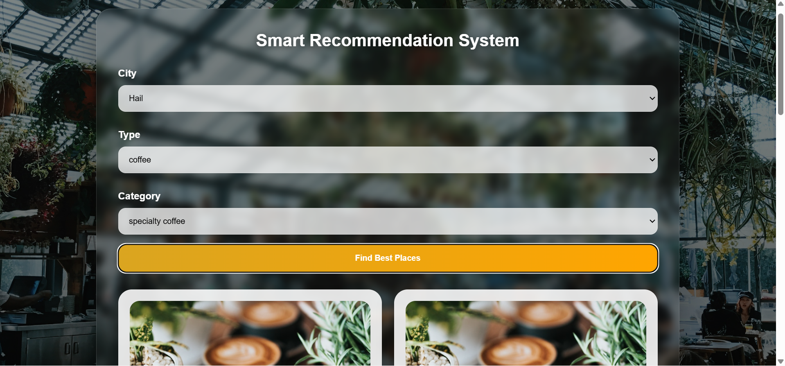

# 🍽️ Smart Recommendation System

🚀 **Live Demo:**
https://smart-recommendation-system-bfau.onrender.com

📂 **GitHub Repository:**
https://github.com/Ziyad28/Recommendation-System

---

## 📸 Preview



Modern glass-style UI with a smart recommendation engine for restaurants and coffee shops.

---

## 🧠 About the Project

An intelligent web application that recommends the best **restaurants and coffee shops** based on real-world data such as:

* ⭐ Ratings
* 📈 Number of reviews

The system ensures accurate and meaningful recommendations using a balanced scoring algorithm.

---

## 🚀 Features

* 🔍 Smart recommendation engine
* 🍕 Restaurants & ☕ Coffee shops
* 🥇 Top 3 results:

  * 🔥 Best Match
  * 🥈 Second
  * 🥉 Third
* ⭐ Dynamic rating system (stars UI)
* 🗺️ Google Maps integration
* 🎨 Modern UI (Glass effect + Background image)
* 📱 Responsive design

---

## 📊 How It Works

The system calculates a score for each place:

```
score = rating + min(reviews / 1000, 1)
```

### Why this works:

* ⭐ High rating = better quality
* 📈 More reviews = higher trust
* ⚖️ Balanced results = realistic recommendations

---

## 🛠️ Technologies Used

### Backend

* Java
* Spring Boot
* REST API

### Frontend

* HTML
* CSS (Glass UI + Gradient + Blur effects)
* JavaScript

### Deployment

* Render (Live hosting)

---

## 🌍 Supported Cities

* Hail
* Riyadh
* Dammam

---

## 🧪 Run Locally

```bash
./mvnw spring-boot:run
```

Then open:

```
http://localhost:8080
```

---

## 🎯 Project Goal

To build a **real-world recommendation system** that combines:

* Data-driven logic
* Clean UI/UX
* Practical backend implementation


---

## ⭐ Future Improvements

* 🤖 AI-based recommendations
* 📍 Real-time Google Maps API integration
* 🧠 User preferences system
* 📊 Advanced ranking algorithm

---

## 💡 Notes

This project is designed to be:

✔ Portfolio-ready
✔ Internship-ready
✔ Production-style UI


---

## 👨‍💻 Developer

**Ziyad Alghadhban**
Software Engineering Student – University of Hail
